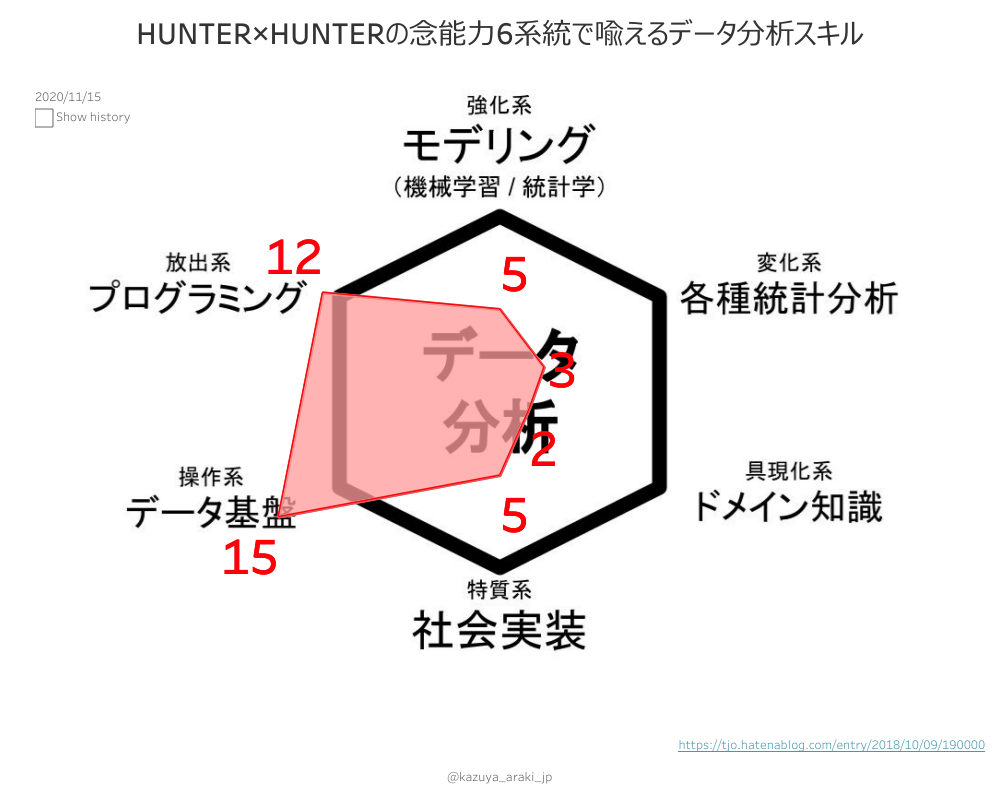
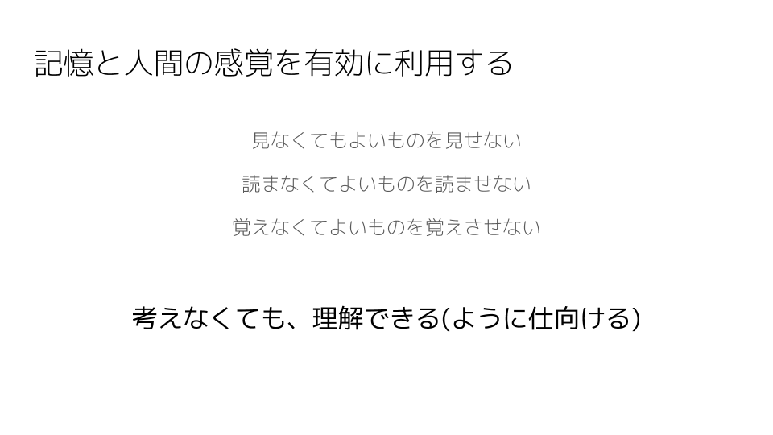
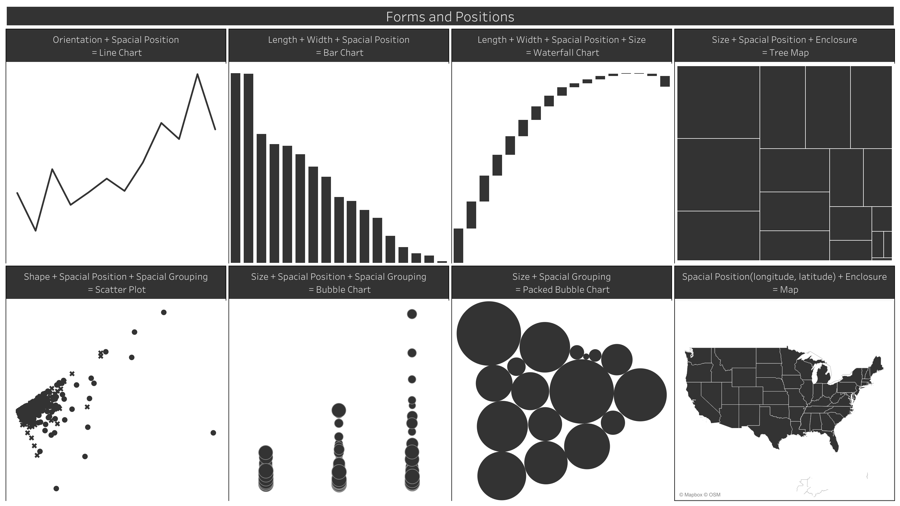

# 職務経歴書

*2023年05月05日*現在

## 基本情報

### 氏名 / Full Name

荒木 和也 / Kazuya Araki

### 生年月日 / Date of Birth

1982年08月30日 / August 30, 1982

### 性別 / Sex

男 / Mele

### 居住地 / Residence

東京都 / Tokyo, Japan

### SNS etc.

- [Twitter - kazuya_araki_jp](https://twitter.com/kazuya_araki_jp)
- [GitHub - araki-ka](https://github.com/araki-ka)
- [Qiita - Kazuya_Araki_Tokyo](https://qiita.com/Kazuya_Araki_Tokyo)
- [note - Kazuya Araki](https://note.com/jedi_trickstar)
- [Medium - kazuya.araki](https://medium.com/@kazuya.araki)
- [facebook - Kazuya Araki](https://www.facebook.com/kazuya.araki.tokyo)
- [Linkedin - kazuya-araki](https://www.linkedin.com/in/kazuya-araki-65680111a/)
- [SlideShare - Kazuya Araki](https://www.slideshare.net/KazuyaARAKI)|
- [Speaker Deck](https://speakerdeck.com/kazuya_araki_tokyo)

## 職務経歴

### 概要

|Term|Company|
|---|---|
|2007年05月~2013年08月|[アロウズ・システム株式会社](http://www.arouse.co.jp/)|
|2013年09月~2017年04月|株式会社レジェンド・アプリケーションズ(現、[株式会社ラキール](https://lakeel.com/))|
|2017年05月~2020年03月|[株式会社ビズリーチ](http://www.bizreach.co.jp/)|
|2020年03月~現在|[株式会社エウレカ](https://eure.jp/)|

### 詳細

#### アロウズ・システム株式会社

|Term|Organization|Role|Contents|
|---|---|---|---|
|2007年05月~2011年04月|オープンシステム開発部|システムエンジニア メンバー|- SAP製品アドイン開発(Java, ABAP)<br>- Webアプリケーション開発(Java, PHP)|
|2011年04月~2012年10月|オープンシステム開発部|システムエンジニア メンバー~リーダー|受託開発(tier 1~tier 3)|
|2012年11月~2013年08月|オープンシステム開発部|システムエンジニア メンバー -> 開発リーダー|- オープンWebシステムの運用保守<br>- 小規模〜中規模程度のシステム改修案件|

#### 株式会社レジェンド・アプリケーションズ

|Term|Organization|Role|Contents|
|---|---|---|---|
|2013年09月~2014年09月|プロダクト開発本部 LaKeel開発グループ LWF開発チーム|フロントエンドエンジニア -> バックエンドエンジニア -> プロダクトリーダー|ワークフローパッケージ「LaKeel Workflow」製品開発|
|2014年10月~2015年01月|AMS開発本部|テスト自動化チームリーダー|Webアプリケーション構築プロジェクト瑕疵対応|
|2015年02月~2016年07月|プロダクト開発本部 LaKeel開発グループ CM開発チーム|アプリケーションエンジニア -> プロダクトリーダー、アーキテクト|ビジネス用チャットパッケージ「COMPANY Messenger(現[LaKeel Messenger](https://messenger.lakeel.com/))」製品開発|
|2016年08月~2017年04月|プロダクト開発本部 LaKeel開発グループ LBI開発チーム|プロダクトマネージャー、アーキテクト、PMO|Business Intelligenceパッケージ「[LaKeel BI](https://bi.lakeel.com/)」製品開発|

#### 株式会社ビズリーチ

|Term|Organization|Role|Contents|
|---|---|---|---|
|2017年05月~2017年12月|事業戦略部 BIグループ|データアナリスト|- ビズリーチサービスデータ抽出、加工、分析<br>- データを用いて既存事業のグロース施策提案<br>- 非エンジニア向けにITリテラシーを向上する活動(技術提供、勉強会、ナレッジシェアリング等)|
|2018年01月|- 事業戦略本部 事業戦略部 BIグループ<br>- ビズリーチ事業本部 サービス開発本部(ビズリーチ) カスタマーマーケティング部(ビズリーチ) カスタマーマーケティングイノベーション(ビズリーチ)|データアナリスト、データエンジニア|- マーケティングチーム兼務<br>- データドリブンマーケティングチームを目指すべく、データ基盤の整備、既存オペレーションの改善提案など、カスタマーマーケティングチームと協働|
|2018年02月~2018年04月|- 事業戦略本部 事業戦略部 BIグループ<br>- マーケティングテクノロジー室|データエンジニア|- マーケティングテクノロジー室兼務<br>- デジタルマーケティングを目指すべく、データ分析基盤の起案、設計|
|2018年05月~2018年07月|- マーケティングテクノロジー室<br>- 事業戦略本部 事業戦略部 BIグループ|データエンジニア|- マーケティングテクノロジー室主務移行<br>- データ分析基盤の要件定義、企画、設計、運用|
|2018年08月~2019年01月|- システム本部 マーケティングテクノロジー室<br>- 事業戦略本部 事業戦略部 BIグループ|データエンジニア、データアナリスト|- データ分析基盤の要件定義、企画、設計、運用保守<br>- Tableau Server管理者<br>- Tableauを利用したデータドリブン組織牽引|
|2019年02月~2019年04月|- リクルーティングプラットフォーム統括本部 マーケティングテクノロジー室<br>- 事業戦略本部 事業戦略部|データエンジニア、データアナリスト|- 同上<br>- カスタマーサイドのデータ分析利活用支援(ダッシュボード作成、データ整備)|
|2019年05月~2019年07月|リクルーティングプラットフォーム統括本部 マーケティングテクノロジー室|データエンジニア、データアナリスト|- 同上<br>- Tableau推進(Classroom開校、Boot Camp)<br>- ビジネスサイドのデータ利活用支援(レポーティング最適化、資料自動化など)|
|2019年08月~2020年01月|HR Techカンパニー リクルーティングプラットフォーム事業ユニット マーケティングテクノロジー室|データエンジニア、データアーキテクト|- 経営指標モニタリングプロジェクト(事業企画と協働)<br>- ビジネスサイドのデータ利活用支援(レポーティング最適化、顧客提供用の定例資料自動化など)<br>- Tableau Server管理<br>- Data Warehouse(Google BigQuery)管理|
|2020年02月~2020年03月|DX推進室|データアナリスト、データアーキテクト|- CSOの意思決定をデータアナリティクスで支援<br>- DBRE、横断プラットフォーム組織とのデータインフラ整備検討<br>- Tableau Server管理<br>- Data Warehouse(Google BigQuery)管理|

#### 株式会社エウレカ

|Term|Organization|Role|Contents|
|---|---|---|---|
|2020年03月~2020年06月|BI Team|Data Analyst and Data Engineer|- モニタリング環境構築 by Tableau<br>- Tableau Server管理<br>- Data Warehouse, Data Mart設計、構築、運用保守|
|2020年07月~2020年09月|BI Team|Data Analyst and Data Engineer|- モニタリング環境構築 by Tableau<br>- Tableau Server管理<br>- Data Warehouse, Data Mart整備<br>- Safety Project|
|2020年10月~2020年12月|BI Team|Data Analyst and Data Engineer|- モニタリング環境構築 by Tableau<br>- Tableau Server管理<br>- Data Warehouse, Data Mart整備<br>- Safety Project<br>- Tableau浸透のためのデータ整備、教育体制計画|
|2021年01月~2021年12月|BI Team|Data Analyst and Data Engineer|- Business KPI, Brand KPIのモニタリング環境整備<br>- ヘルスチェック用レポートのエンハンス(Tableau化、パフォーマンス改善、運用改善)<br>- Safety Project|
|2022年01月~2022年03月|BI Team|Data Analyst and Data Engineer|- 新データ分析基盤構築<br>- Safety Project|
|2022年04月~2023年01月|BI Team|Data Analyst and Data Engineer|- 新データ分析基盤構築<br>- Pairs Core Dashboard Project|
|2023年02月~現在|Data Management Team|Data Engineer|- 新データ分析基盤構築<br>- ログ基盤刷新Project|

## 資格

- 実用数学技能検定3級
- TOEIC 600
- 普通自動車運転免許(AT限定)
- 統計検定3級
- [DATA Saber](https://datasaber.world/) a.k.a. Trickstar

## スキル

### [HUNTER×HUNTERの念能力6系統で喩えるデータ分析スキル](https://tjo.hatenablog.com/entry/2018/10/09/190000)

- 強化系(モデリング) : 1
- 変化系(各種統計分析) : 1
- 放出系(プログラミング) : 15
- 具現化系(ドメイン知識) : 10
- 操作系(データ基盤) : 15
- 特質系(社会実装) : 1

[Tableau Public](https://public.tableau.com/app/profile/kazuya.araki/viz/HUNTERHUNTER6/HUNTERHUNTER6?:embed=y&:display_count=yes)


### Portfolio

- [Tableau Public](https://public.tableau.com/app/profile/kazuya.araki#!/)

### OS

- Windows
- macOS
- Linux
  - CentOS
  - RedHat Enterprise Linux(RHEL)
  - Ubuntu
  - Amazon Linux 2

### Language

- Java
  - Spring Framework
  - Oracle JDK
  - Android SDK
  - Java EE
- JavaScript
  - Anguler
  - Node.js
  - JQuery
- Python
  - pip
  - Pyenv
  - Django
  - Anaconda
  - Deep Learning
    - numpy
    - matplotlib
    - etc...
  - ML
    - TensorFlow
    - scikit-learn
    - Chainer
    - etc...
- Swift
  - Express
- Objective-C
  - CocoaPods
- PHP
- C#
- VB.Net
- C
- HTML
- CSS
- R
- Terraform

### Middleware

- Web Server
  - Apache HTTP Server
  - Nginx
- Application Server
  - Tomcat
  - JBoss
  - IIS
  - WebSphere Application Server
- Database
  - RDBMS
    - MySQL
    - MariaDB
    - PostgreSQL
    - Microsoft SQL Server
    - Microsoft Access
    - Oracle Database
    - SQLite
    - Persto
  - NoSQL
    - MongoDB
    - Apache Cassandra
    - Neo4j
- Data Warehouse
  - SAP BW

### Cloud

- [AWS](https://aws.amazon.com/jp/)
  - EC2
  - EBS
  - S3
  - SQS
  - Redshift
  - CloudWatch
- [Google Cloud Platform](https://cloud.google.com)
  - [IAM & Admin](https://cloud.google.com/iam/)
  - Security
    - Zero Trust
      - [VPC Service Control](https://cloud.google.com/vpc-service-controls/)
      - [Access Context Manager](https://cloud.google.com/access-context-manager/docs)
  - Compute
    - [Compute Engine](https://cloud.google.com/compute/)
  - Serverless
    - [Cloud Functions](https://cloud.google.com/functions/)
    - [App Engine](https://cloud.google.com/appengine/)
  - Storage
    - [Cloud Storage](https://cloud.google.com/storage/)
  - Networking
    - [VPC Network](https://cloud.google.com/vpc/)
  - Operations
    - [Monitoring](https://cloud.google.com/monitoring/)
    - [Debuger](https://cloud.google.com/debugger/)
    - [Logging](https://cloud.google.com/logging/)
    - [Trace](https://cloud.google.com/trace/)
  - Analytics
    - [Composer](https://cloud.google.com/composer/)
    - [Pub/Sub](https://cloud.google.com/pubsub/)
    - [Dataflow](https://cloud.google.com/dataflow/)
    - [BigQuery](https://cloud.google.com/bigquery/)
    - [Data Catalog](https://cloud.google.com/dataplex)
    - [Dataprep](https://cloud.google.com/dataprep/)
- [さくらのクラウド](https://cloud.sakura.ad.jp/)
- [TREASURE DATA](https://www.treasuredata.co.jp/)

### IDE

- [Eclipse](https://www.eclipse.org/)
- [IntelliJ IDEA](https://www.jetbrains.com/idea/)
- [Light Table](http://lighttable.com/)
- [Xcode](https://developer.apple.com/xcode/)
- [Android Studio](https://developer.android.com/studio)
- [Visual Studio](https://visualstudio.microsoft.com/)
- [Visual Studio Code](https://code.visualstudio.com/)
- [SQL Server Management Studio(SSMS)](https://docs.microsoft.com/ja-jp/sql/ssms/download-sql-server-management-studio-ssms)
- [PyCharm](https://www.jetbrains.com/pycharm/)

### Tools

- BI
  - [Tableau](https://www.tableau.com/)
  - [Power BI](https://powerbi.microsoft.com/en-us/)
  - [Looker Studio](https://cloud.google.com/looker-studio)
  - [redash](https://redash.io/)
  - [Apache Superset](https://superset.apache.org/)
  - [metabase](https://www.metabase.com/)
- ELT
  - [dbt](https://www.getdbt.com/)
  - [Talend Open Studio](https://www.talend.com/products/talend-open-studio/)
- Workflow, Orchestration
    - [Apache Airflow](https://airflow.apache.org/)
    - [Dagster](https://dagster.io/)

## Vision / Mission

### Vision

```
データの力で世界を変革するトリックスターとして、人々を導く存在となる
```

### Mission

```
- データの導き手として、価値あることを正しく発信する
- データの導き手として、常にトップランナーであり続ける
- データの導き手として、教育、育成への投資を行う
```

## 座右の銘

- 価値あることを正しく行う
- 現状に満足せず、常に好奇心を持ち続ける
- Stay Hungry, Stay Foolish.
- Simple is the best.
- Time Is Money.

## 実績

### 登壇

|Date|Title|
|---|---|
|2018年09月26日|Data Peopleの為の勉強会\~eureka×Leverages×BizReach\~|
|2018年10月01日|Tableau Server運用管理者ミートアップ|
|2018年11月14日|Data Analyst Meetup Tokyo Vol.8|
|2019年05月14日|Tableau Data Day Out Tokyo|
|2019年08月19日|[第1回 Tableau Server 運用管理者ユーザー会](https://techplay.jp/event/743100)|
|2019年10月21日|[Tableauデータサイエンス勉強会 第4回 - 画像認識技術とBIの巻-](https://techplay.jp/event/750555)|
|2019年11月25日|[第2回 Tableau Server 運用管理者ユーザー会](https://techplay.jp/event/746910)|
|2021年01月25日|[BIツールカジュアル座談会 ~Redash と Metabase~](https://bitoollabo.connpass.com/event/199913/)|
|2023年04月24日|[Tableauユーザー会](https://speakerdeck.com/kazuya_araki_tokyo/tableaushi-li-shao-jie-and-ke-ti-gong-you)|

### メディア、ブログ掲載

|Date|Title|
|---|---|
|2018年07月18日|[データの力で、事業を加速する｜BIグループの仕事を公開！](https://reachone.bizreach.co.jp/entry/2018/07/18/145421)|
|2018年11月29日|[「Data Analyst Meetup Tokyo vol.8」に弊社データアナリストが登壇しました！](https://reachone.bizreach.co.jp/entry/2018/11/29/160043)|
|2019年02月13日|[高校生に向けてAIとBIのデータ活用講座を開催しました！](https://reachone.bizreach.co.jp/entry/2019/02/13/113418)|
|2019年07月29日|[Tableauが3か月でBI人材を育てるブートキャンプ──企業にデータ分析文化を広めるデータセイバー](https://bizzine.jp/article/detail/3543)|
|2020年03月30日|[入社エントリー: 3月にエウレカに入社し、BIチームにJOINいたしました荒木です。](https://www.wantedly.com/companies/eureka/post_articles/225086)|
|2021年12月14日|[redashの断捨離を実施したので、方法を共有します](https://medium.com/eureka-engineering/redash%E3%81%AE%E6%96%AD%E6%8D%A8%E9%9B%A2%E3%82%92%E5%AE%9F%E6%96%BD%E3%81%97%E3%81%9F%E3%81%AE%E3%81%A7-%E6%96%B9%E6%B3%95%E3%82%92%E5%85%B1%E6%9C%89%E3%81%97%E3%81%BE%E3%81%99-9ffaeaccc910)|
|2022年07月25日|[第5回 BIツールを用いたデータ可視化業務の要件定義プロセス - BIツールユーザーによる、BIツールユーザーのための、BIツールのトリセツ](https://data.wingarc.com/all-about_bitool_05-43435)|
|2022年07月25日|[第7回レポート・ダッシュボードの断捨離の重要性 - BIツールユーザーによる、BIツールユーザーのための、BIツールのトリセツ](https://data.wingarc.com/all-about_bitool_07-43472)|

### 著書

|Date|Title|
|---|---|
|2022年03月01日|[動き出すデータドリブン組織のつくりかた Tableau Blueprintに学ぶ実践的アプローチ](https://amzn.to/3gOvJC9)|


## 興味があるもの

### データ × ○○

#### データ × デザイン = ビジュアルアナリティクス

  
  


#### データ × マーケティング = デジタルマーケティング

データサイエンスは、マーケティングと親和性の高い分野です。  
そのため、これまでの知見を基に、マーケティング施策に転じることのできるテーマとして着目しています。  
直近はデジタルマーケティングにつながる以下の活動をしています。

- データ分析基盤の設計、構築、運用
  - Google BigQuery
  - ARM Treasure Data
- データ利活用アドバイザー
  - Tableau Doctor(Tableauに関するアドバイス、コーチング)
    - Tableau Desktop
    - Tableau Prep Builder
    - Tableau Server
    - Tableau Online
  - Google
    - Looker Studio
    - BigQuery

#### データ × エンジニアリング × 教育 = 非エンジニアに対してのテクノロジー教育

- 実績
  - 主催
    - SQL勉強会
    - 構成管理(Git)ハンズオン
    - BigQuery基礎ハンズオン
    - Tableau 社内Classroom
    - Standard SQL 社内Classroom
  - アドバイザーとして
    - Tableau
    - Python
    - Java(+ Spring Framework)

#### データ × 業務効率化

エンジニアではない層は、リテラシーの壁もあって、有効にITを活用できていないファクトもあります。  
データとテクノロジーの力を使い、非効率業務にイノベーションを起こし、業務効率化を図っています。

### 読書とアウトプット

- ジャンル
  - ビジネス
  - Finance
  - 歴史、哲学などリベラルアーツ
- テーマについて議論したり書評を述べたりするアウトプット(という名の発散)が重要だと考えています。
- 読書会、輪読会歓迎。

## どんなことがしたいか？

### 社会貢献度の高いデータを安心安全に利活用したい

COVID-19のデータ利活用が進んでいます。  
[新型コロナウイルス 国内感染の状況 - 東洋経済オンライン](https://toyokeizai.net/sp/visual/tko/covid19/)  
[東京都 新型コロナウイルス感染症対策サイト](https://stopcovid19.metro.tokyo.lg.jp/)  
COVID-19に限らず、世の中にある様々なデータを安心安全に利活用できないか、常々考えています。  
- 安心安全なデータプラットフォームが提供できないか？
- 人間の可処分時間を費やすことなく、持続的かつ継続的に正しいデータを取得できないか？
- 個人情報保護法、GDPRといった各種法律を踏まえた活動、啓蒙ができないか？
- 場合によってはビジネスチャンスにつながるようなことができないか？

### データ活用人材の育成、データ人材の市場価値向上

データリテラシーの高い人材が今後のビジネスのあり方を変えていくと考えています。  
データアナリスト、データサイエンティスト、データエンジニアなど、データに携わる職種の価値を欧米諸国並に向上させたいです。  

### データ人材界隈イベント

知見と人脈を広げるために、データ人材界隈のイベントに参加したりしています。  
機会があれば登壇しております。
