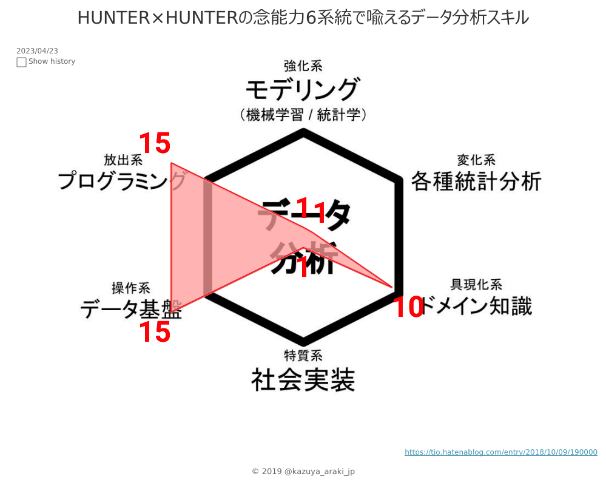

# 職務経歴書

2019年09月09日現在

## 基本情報

|Key|Value|
|---|---|
|氏名|荒木 和也|
|生年月日|1982年08月30日|
|性別|男|
|血液型|O|
|居住地|東京都中野区|
|note|[Kazuya Araki](https://note.mu/jedi_trickstar)|
|Twitter|[kazuya_araki_jp](https://twitter.com/kazuya_araki_jp)|
|GitHub|[araki-ka](https://github.com/araki-ka)|
|Bitbucket|[araki-ka](https://bitbucket.org/araki-ka/)|
|facebook|[Kazuya Araki](https://www.facebook.com/kazuya.araki.tokyo)|
|Linkedin|[kazuya-araki](https://www.linkedin.com/in/kazuya-araki-65680111a/)|
|SlideShare|[Kazuya Araki](https://www.slideshare.net/KazuyaARAKI)|

## 職務経歴

### 概要

|Term|Overview|
|---|---|
|2007年05月~2013年08月|[アロウズ・システム株式会社](http://www.arouse.co.jp/)|
|2013年09月~2017年04月|[株式会社レジェンド・アプリケーションズ](http://www.legendapl.com/)|
|2017年05月~現在|[株式会社ビズリーチ](http://www.bizreach.co.jp/)|

### 詳細

#### アロウズ・システム株式会社

|Term|Content|Organization / Role|
|---|---|---|
|2007年05月~2011年04月|- SAP製品アドイン開発(Java, ABAP) - Webアプリケーション開発(Java, PHP)|メンバー|
|2011年04月~2012年10月|受託開発(tier 1~tier 3)|メンバー~リーダー|
|2012年11月~2013年08月|- オープンWebシステムの運用保守 - 小規模〜中規模程度のシステム改修案件|メンバー -> 開発リーダー|

#### 株式会社レジェンド・アプリケーションズ

|Term|Content|Organization / Role|
|---|---|---|
|2013年09月~2014年09月|ワークフローパッケージ「LaKeel Workflow」製品開発|開発メンバー -> プロダクトリーダー|
|2014年10月~2015年01月|Webアプリケーション構築プロジェクト瑕疵対応|メンバー、テスト自動化チームリーダー|
|2015年02月~2016年07月|ビジネス用チャットパッケージ「COMPANY Messenger(現[LaKeel Messenger](https://messenger.lakeel.com/))」製品開発|メンバー -> プロダクトリーダー、アーキテクト|
|2016年08月~2017年04月|Business Intelligenceパッケージ「[LaKeel BI](https://bi.lakeel.com/)」製品開発|プロダクトマネージャー(≒プレイングマネージャー)、アーキテクト、PMO|

#### 株式会社ビズリーチ

|Term|Content|Organization / Role|
|---|---|---|
|2017年05月~2017年07月|事業戦略部 BIグループ|データ抽出、加工、分析。 データを用いて既存事業をグロースさせる施策を考えたりしています。|
|2017年08月~2017年12月|事業戦略本部 事業戦略部 BIグループ(組織名変更のみ)|上記は継続。 データサイエンティスト活動開始。 非エンジニア向けにITリテラシーを向上する活動(技術提供、勉強会、ナレッジシェアリング等)。|
|2018年01月|事業戦略本部 事業戦略部 BIグループ 兼 ビズリーチ事業本部 サービス開発本部(ビズリーチ) カスタマーマーケティング部(ビズリーチ) カスタマーマーケティングイノベーション(ビズリーチ)|上記に加え、マーケティングチームを兼務。 データドリブンマーケティングチームを目指すべく、データ基盤の整備、既存オペレーションの改善提案など、カスタマーマーケティングチームと協働。|
|2018年02月~2018年04月|事業戦略本部 事業戦略部 BIグループ 兼 マーケティングテクノロジー室|マーケティングテクノロジー室を兼務。 デジタルマーケティングを目指すべく、分析基盤のあり方を考え、実行に移す。|
|2018年05月~2018年07月|マーケティングテクノロジー室 兼 事業戦略本部 事業戦略部 BIグループ|マーケティングテクノロジー室に主務移転。 データ分析基盤の要件定義、企画、設計、運用を担当。 データにまつわる知見を広めていき、データドリブン企業を推進。|
|2018年08月~2019年01月|システム本部 マーケティングテクノロジー室 兼 事業戦略本部 事業戦略部 BIグループ|データ分析基盤の要件定義、企画、設計、運用保守 Tableau Server管理者 Tableauを利用したデータドリブン組織牽引|
|2019年02月~2019年04月|リクルーティングプラットフォーム統括本部 マーケティングテクノロジー室 兼 事業戦略本部 事業戦略部|同上。 カスタマーサイドのデータ分析利活用支援(ダッシュボード作成、データ整備)。|
|2019年05月~2019年07月|リクルーティングプラットフォーム統括本部 マーケティングテクノロジー室|同上。 Tableau推進(Classroom開校、Boot Camp) ビジネスサイドのデータ利活用支援(レポーティング最適化、資料自動化など)|
|2019年08月~現在|HR Techカンパニー リクルーティングプラットフォーム事業ユニット マーケティングテクノロジー室|経営指標モニタリング支援(事業企画と協働) ビジネスサイドのデータ利活用支援(レポーティング最適化、資料自動化など)|

## 資格

- 実用数学技能検定3級
- TOEIC 600
- 普通自動車運転免許(AT限定)
- 統計検定3級
- 8th Tableau DATA Saber(a.k.a. Trickstar)

## スキル

### [HUNTER×HUNTERの念能力6系統で喩えるデータ分析スキル](https://tjo.hatenablog.com/entry/2018/10/09/190000)
- 強化系(モデリング) : 5
- 変化系(各種統計分析) : 3
- 放出系(プログラミング) : 10
- 具現化系(ドメイン知識) : 3
- 操作系(データ基盤) : 12
- 特質系(社会実装) : 10

[Tableau Public](https://public.tableau.com/views/HUNTERHUNTER6/HUNTERHUNTER6?:embed=y&:display_count=yes)

### Portfolio

- [Tableau Public](https://public.tableau.com/profile/kazuya.araki#!/)

### OS

- Windows
- macOS
- Linux
    - CentOS
    - RedHat Enterprise Linux(RHEL)
    - Ubuntu

### Language

- Java
    - Spring Framework
    - Oracle JDK
    - Android SDK
    - Java EE
- JavaScript
    - Anguler
    - Node.js
    - JQuery
- Python
    - pip
    - Pyenv
    - Django
    - Anaconda
    - Deep Learning
        - numpy
        - matplotlib
        - etc...
    - ML
        - TensorFlow
        - scikit-learn
        - Chainer
        - etc...
- Swift
    - Express
- Objective-C
    - CocoaPods
- PHP
- C#
- VB.Net
- C
- HTML
- CSS
- R

### Middleware

- Web Server
    - Apache HTTP Server
    - Nginx
- Application Server
    - Tomcat
    - JBoss
    - IIS
    - WebSphere Application Server
- Database
    - RDBMS
        - MySQL
        - MariaDB
        - PostgreSQL
        - Microsoft SQL Server
        - Microsoft Access
        - Oracle Database
        - SQLite
        - Persto
    - NoSQL
        - MongoDB
        - Apache Cassandra
        - Neo4j
- Data Warehouse
    - SAP BW

### Cloud
- [AWS](https://aws.amazon.com/jp/)
    - EC2
    - EBS
    - S3
    - SQS
    - Redshift
    - CloudWatch
- [Google Cloud Platform](https://cloud.google.com/?hl=ja)
    - Products
        - [IAM & Admin](https://cloud.google.com/iam/)
        - Security
            - [VPC Service Control](https://cloud.google.com/vpc-service-controls/)
    - Compute
        - [App Engine](https://cloud.google.com/appengine/)
        - [Compute Engine](https://cloud.google.com/compute/)
        - [Cloud Function](https://cloud.google.com/functions/)
    - Storage
        - [Cloud Storage](https://cloud.google.com/storage/)
            - [Storage Transfer Service](https://cloud.google.com/storage-transfer/docs/)
    - Networking
        - [VPC Network](https://cloud.google.com/vpc/)
    - [Stackdriver](https://cloud.google.com/stackdriver/)
        - [Monitoring](https://cloud.google.com/monitoring/)
        - [Debuger](https://cloud.google.com/debugger/)
        - [Trace](https://cloud.google.com/trace/)
        - [Logging](https://cloud.google.com/logging/)
    - Big Data
        - [Dataflow](https://cloud.google.com/dataflow/)
        - [BigQuery](https://cloud.google.com/bigquery/)
            - [BigQuery Data Transfer Service](https://cloud.google.com/bigquery/transfer/)
        - [Pub/Sub](https://cloud.google.com/pubsub/)
        - [Dataproc](https://cloud.google.com/dataflow/)
        - [Dataprep](https://cloud.google.com/dataprep/)
- [さくらのクラウド](https://cloud.sakura.ad.jp/)
- [TREASURE DATA](https://www.treasuredata.co.jp/)

### IDE

- [Eclipse](https://www.eclipse.org/)
- [IntelliJ IDEA](https://www.jetbrains.com/idea/)
- [Light Table](http://lighttable.com/)
- [Xcode](https://developer.apple.com/jp/xcode/)
- [Android Studio](https://developer.android.com/studio/index.html)
- [Visual Studio](https://www.microsoft.com/ja-jp/dev/default.aspx)
- [Visual Studio Code](https://code.visualstudio.com/)
- [SQL Server Management Studio(SSMS)](https://docs.microsoft.com/ja-jp/sql/ssms/download-sql-server-management-studio-ssms)
- [PyCharm](https://www.jetbrains.com/pycharm/)

## 座右の銘

- Stay Hungry, Stay Foolish.
- Simple is the best.
- 現状に満足せず、常に好奇心を持ち続ける
- Time Is Money.

## 興味があるもの

### データ × ○○

#### データ × デザイン = ビジュアルアナリティクス

  
  

#### データ × マーケティング = デジタルマーケティング

データサイエンスは、マーケティングと親和性の高い分野です。  
そのため、これまでの知見を基に、マーケティング施策に転じることのできるテーマとして着目しています。  
直近はデジタルマーケティングにつながる以下の活動をしています。
- データ分析基盤の設計、構築、運用
    - Google BigQuery
    - ARM Treasure Data
- データ利活用アドバイザー
    - Tableau Doctor(Tableauに関するアドバイス、コーチング)
        - Tableau Desktop
        - Tableau Prep Builder
        - Tableau Server
    - Google
        - Data Studio
        - BigQuery

#### データ × エンジニアリング × 教育 = 非エンジニアに対してのテクノロジー教育

- 実績
    - 主催
        - SQL勉強会
        - 構成管理(Git)ハンズオン
        - BigQuery基礎ハンズオン
        - Tableau 社内Classroom
        - Standard SQL 社内Classroom
    - アドバイザー
        - Tableau
        - Python
        - Java(+ Spring Framework)

#### データ × 業務効率化

エンジニアではない層は、リテラシーの壁もあって、有効にITを活用できていないファクトもあります。  
データとテクノロジーの力を使い、非効率業務にイノベーションを起こし、業務効率化を図っています。

### Deep Learning

- R&D的な活動
    - Deep Learning、機械学習について、業務活用のための試験中。
        - 重回帰分析を用いてCustomer領域のデータモデルパッケージを試作。
        - 教師なし学習を用いたHR領域の予測モデルを適用。
    - Tableau + Python
        - 簡単な予測モデルのドラフトを作成。 

### 読書とアウトプット

- 読書ジャンルはビジネス、歴史、哲学などリベラルアーツ全般。
- テーマについて議論したり書評を述べたりするアウトプット(という名の発散)が重要だと考えています。
- 読書会、輪読会歓迎。

## どんなことがしたいか？

### データ活用人材の育成、価値向上

データリテラシーの高い人材が今後の業務のあり方を変えていくと考えています。  
データアナリスト、データサイエンティストなど、データに携わる職種の価値を欧米諸国並に向上させたいです。  
(ただ、現状はデータリテラシーとビジネススキルの双方を持ち合わせた人材はなかなか市場にはいないのが現実です)

### データ人材界隈イベント

知見と人脈を広げるために、データ人材界隈のイベントに参加したりしています。  
最近登壇したりLTに参加し、アウトプットしています。

#### 登壇実績

|Date|Event|
|---|---|
|2018年09月26日|Data Peopleの為の勉強会\~eureka×Leverages×BizReach\~|
|2018年10月01日|Tableau Server運用管理者ミートアップ|
|2018年11月14日|Data Analyst Meetup Tokyo Vol.8|
|2019年05月14日|Tableau Data Day Out Tokyo|
|2019年08月19日|第1回 Tableau Server 運用管理者ユーザー会|

### 価値あることを正しく行う。正しいことに価値を与えること

[現職の企業理念(バリュー)](http://www.bizreach.co.jp/corporate_info/principles/)にある、 **価値あることを、正しくやろう** という言葉にとても感銘を受けています。  
特に数字を取り扱ったり、アウトプットする職である以上、正しいことは当然の行動指針であるべきだと考えています。  
また、正しいことであるにも関わらず価値提供できていないこと(先のエンジニアの地位など)を適切な価値を届けていきたいです。
